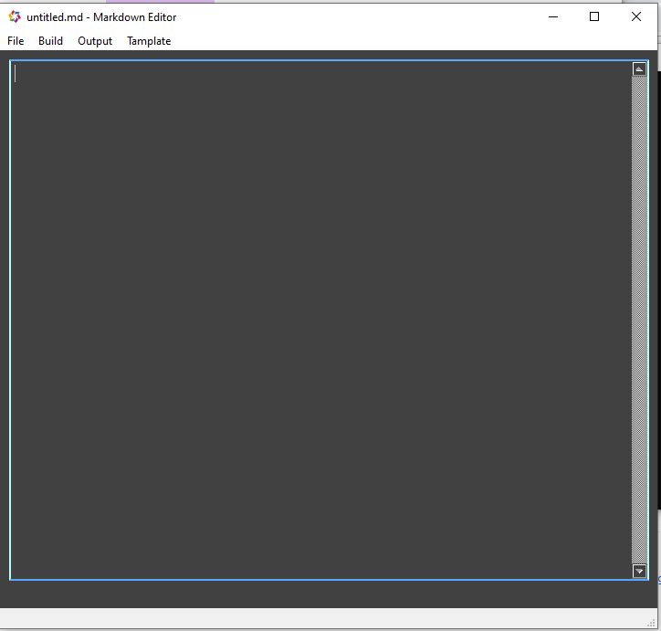
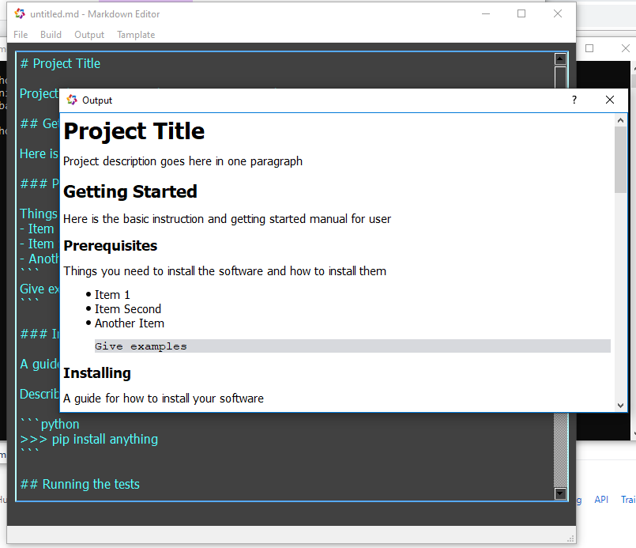
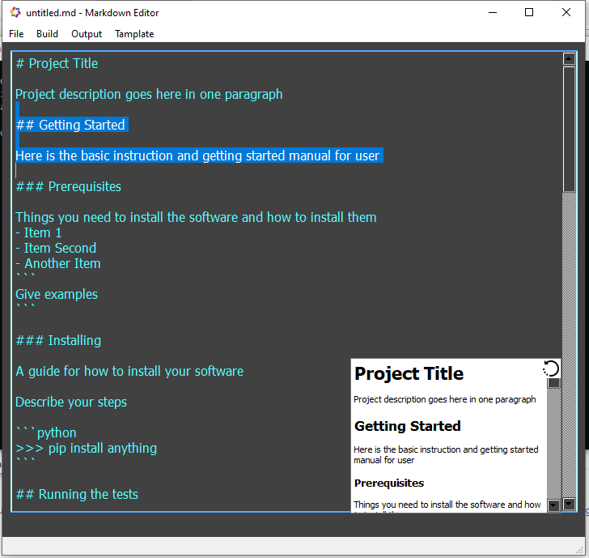

# Markdown Editor

A easy and simple GUI editor for markdown text. It can edit and run the markdown and .rst file format. 

Editor | Run | Instant Run
:-------------------------:|:-------------------------:|:-------------------------:
 |  | 

### Prerequisites

To run the binary we need the folling enviroment
- window 

To execute from the source code we need following dependencryes
- PyQt5
- mistune

### Installing

To install the dependencryes

```
>>> pip install pyqt5
>>> pip install mistune
```

## Build

Explain how to run the automated tests for this system

```batch
build.bat
or 
build.sh
```

## Deployment

&copy; 

## Built With

* [Python](https://python.org/) - Core Language
* [PyQt5](https://example.com) - GUI framework
* [mistune](https://example.com) - Code formater

## Contributing

Please read [CONTRIBUTING.md](https://example.com) for details on our code of conduct, and the process for submitting pull requests to us.

## Versioning

We use [GitHub](http://github.com/) for versioning. For the versions available.

## Authors

* **Prashant Kumar** - *Initial work* - [Sixpetal](https://github.com/Krprashant94)

See also the list of [contributors](https://github.com/project/contributors) who participated in this project.

## License

This project is licensed under the MIT License - see the [LICENSE.md](LICENSE.md) file for details
